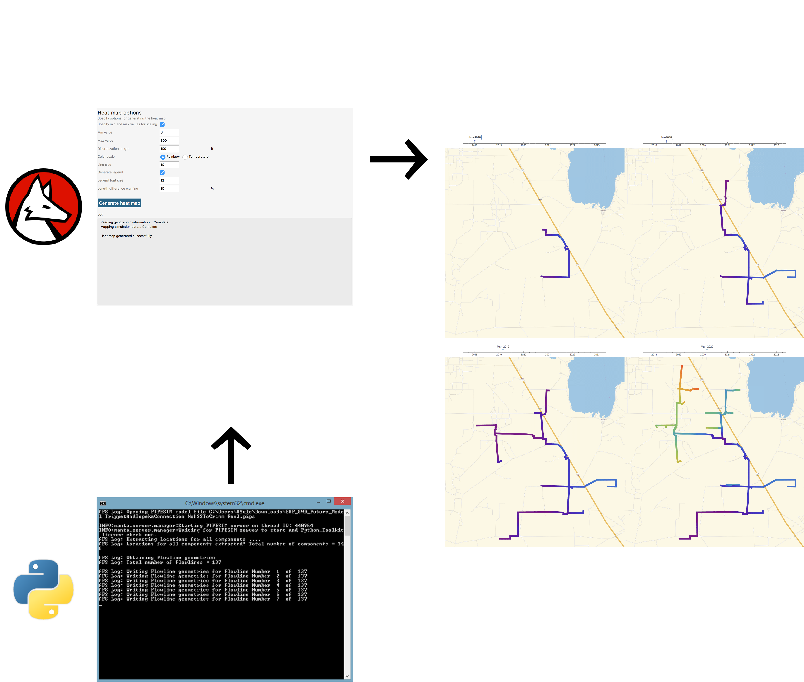

# Utilizing technology to give operators better insights

## How do you visualize complicated pipeline networks?

The shale revolution in the oil and gas industry has created many unique challenges for operators. The need to optimize production from a company's assets is larger than ever before and that has spurred significant engineering efforts to create gathering systems capable of delivering that production successfully. Assured Flow Solutions specializes in analyzing these complex networks of pipelines and helps operators to design and operate them as efficiently as possible.

One of the challenges we frequently encounter is how to visually see what's occurring throughout these complicated systems in the best way possible. To address these needs, we have developed a proprietary heat map technology to help visualize field data and simulation results in GIS software such as Google Earth and Global Mapper. The technology allows us to visualize parameters like pressures, temperatures, and flow rates in the field to quickly determine bottlenecks or potential impacts of operational changes.

## Technology to the rescue!

While these heat maps provide simple and intuitive visualizations of conditions in the field, their creation is actually a very complicated process with several moving pieces. At the highest level, we take raw scalar data, either from the field or else from simulation results, and map it to a geographical coordinate system using latitudes and longitudes. The final result is an actual GIS file that can be loaded and viewed using any traditional GIS software.

To accomplish the process successfully, we've developed a number of algorithms that leverage several technology stacks. For example, we use the Wolfram Language to create many of the algorithms used for mapping the coordinate system and we use Python to integrate with various simulation software packages allowing the process to be fully automated.

## Looking ahead

Our heat map technology has been in development for over a year, but has now reached a very mature state. We're able to adapt the technology to all kinds of field data and simulation engines, allowing us to leverage it on all of our projects. We believe the resulting simple and intuitive visuals provide huge insights for operators seeking to gain a better understanding of their field or what conditions may look like if changes are made.

As we look ahead to the future, we see a great potential to help operators even further by deploying our technology to employees on the ground in real time to help diagnose issues as they occur.