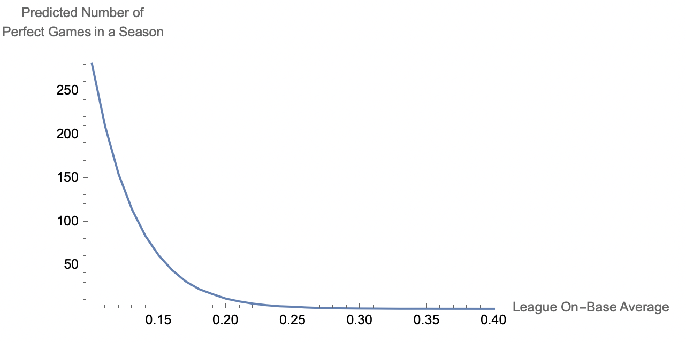

# On-base percentage for a certain number of perfect games

I always enjoy reading the weekly riddler puzzles from 538 ([link](https://fivethirtyeight.com/tag/the-riddler/)). My background is not in statistics, but I enjoy the puzzles because they're typically just the right amount of complexity to solve in a reasonable time frame and the topics are interesting and wide-ranging. When there is one involving sports, it's even better.

Here's the riddler express from June 3rd 2021 discussing baseball perfect games:


>*"How low would a batter's chances of reaching base have to be for you to expect one perfect game per season? (You can make the following simplifying assumptions: All batters have the same chances of reaching base; at-bats are independent from each other; there are 30 MLB teams, and each club plays 162 games; and no games go into extra innings.)"*
>

My preferred computational tool is the Wolfram Language so I'll take a stab at solving this riddler using it.

First, let's define some global constants based on what we are allowed to assume.

```
gamesPerYear = 162;
teams = 30;
numberOfInnings = 9;
atBatsPerInning = 3;
atBatsDuringAGame = numberOfInnings*atBatsPerInning;
```

```
createDist[onBasePct_] := 
 EmpiricalDistribution[{1 - onBasePct, onBasePct} -> {0, 1}]
```

 Simulating a full season requires us to randomly sample our on-base distribution for the total number of at bats that we can expect for every game played across each team. Then, to ensure we account for randomness correctly, because this is a simulation, we need to repeat this process a number of times. The more we perform a simulation, averaging the results, the better our prediction will be.

RandomVariate lets us sample our distribution a number of times and create nested arrays. In this case we simulate the number of at bats in a game for each team across an entire season 100 times. Then for each simulation we count the number of perfect games we have and take an average across the full number of season simulations.

```
numberOfSeasonSimulations = 100;

simulateFullSeason[onBasePct_] := 
 Module[{dist, data, perfectGameCount},
  	dist = createDist[onBasePct];
  	data = RandomVariate[createDist[onBasePct], {
     		numberOfSeasonSimulations,
     		teams*gamesPerYear,
     		atBatsDuringAGame
     	}];
  	perfectGameCount = Map[Count[x_ /; AllTrue[x, EqualTo[0]]]]@data;
  	N@Mean[perfectGameCount]
  ]
```

Simulating each season multiple times for various on-base averages let's us see how the number of predicted perfect games in a season varies.

```
results = 
 Table[{onBasePct, simulateFullSeason[onBasePct]}, {onBasePct, 0.1, 
   0.4, 0.01}]
```

```
{{0.1, 282.13}, {0.11, 209.22}, {0.12, 154.54}, {0.13, 114.1}, {0.14, 
  83.69}, {0.15, 61.1}, {0.16, 44.35}, {0.17, 31.48}, {0.18, 
  22.6}, {0.19, 16.87}, {0.2, 11.67}, {0.21, 8.46}, {0.22, 
  5.96}, {0.23, 4.16}, {0.24, 2.9}, {0.25, 2.34}, {0.26, 1.51}, {0.27,
   0.98}, {0.28, 0.64}, {0.29, 0.49}, {0.3, 0.33}, {0.31, 
  0.27}, {0.32, 0.16}, {0.33, 0.06}, {0.34, 0.07}, {0.35, 
  0.08}, {0.36, 0.03}, {0.37, 0.03}, {0.38, 0.03}, {0.39, 0.}, {0.4, 
  0.}}
```

```
ListLinePlot[
 	results,
 	AxesLabel -> {"League On-Base Average", 
   "Predicted Number of\nPerfect Games in a Season"},
 	ImageSize -> 500
 ]
```


And finally, using the results we can calculate the required on-base average that would lead to one perfect game per season

```
FindRoot[Interpolation[results][onBasePct] == 1, {onBasePct, 0.2}]
```
```
{onBasePct -> 0.269623}
```