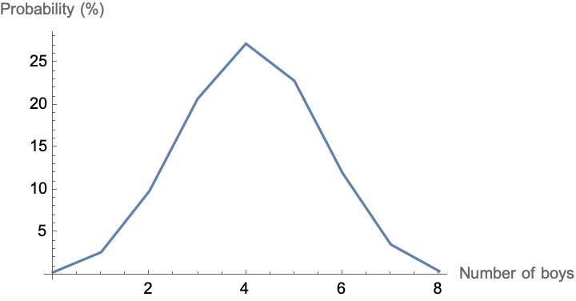

# What are the chances: Simulating daughters and sons in my wife and I’s friend group
My wife and I have two beautiful girls. Ironically, between us and my wives 3 closest friends, the number of girls we have is 7 while the number of boys is just 1. We were causally talking the other day about how rare that seemed, so I figured I’d find out just how rare it actually is.
I’ll start first by simulating this because I enjoy simulating statistical problems and later we can solve it analytically.

First, create a distribution to give us an equally weighted boy or girl (we’ll come back to this assumption later).
```
distEqual = EmpiricalDistribution[{1/2, 1/2} -> {0, 1}]
```
```
DataDistribution[Type: Empirical
Data points: 2

]
```
Next, simulate having 8 kids 1,000,000 times and count the number of times we see a group of kids with only 1 boy.
```
totalNumberOfKids = 8;
numberOfSimuations = 1000000;
```
```
simulatedDataEqual = 
  RandomVariate[distEqual, {numberOfSimuations, totalNumberOfKids}];
```
```
N[Count[simulatedDataEqual, group_ /; Total[group] == 7]/
   numberOfSimuations]*100
```
```
3.1334
```
So, essentially there’s around a 3% chance that among all our 8 kids together, we would have ended up with only 1 boy
Now, I’ve heard before that for whatever reason the actual percentage of boys born to girls (naturally) isn’t quite 50%, but is actually skewed towards boys by about 105 boys per 100 girls ([source](https://ourworldindata.org/gender-ratio#sex-ratio-at-birth)). So if we repeat that same analysis, but with updated boy/girl ratio, let’s see how it changes our actual likelihood of only having 1 boy in our groups kids.
```
distActual = EmpiricalDistribution[{105, 100} -> {0, 1}]
```
```
DataDistribution[Type: Empirical
Data points: 2

]
```
```
totalNumberOfKids = 8;
numberOfSimuations = 1000000;
```
```
simulatedDataActual = 
  RandomVariate[distActual, {numberOfSimuations, totalNumberOfKids}];
```
```
N[Count[simulatedDataActual, group_ /; Total[group] == 7]/
   numberOfSimuations]*100
```
```
2.6929
```
Based on real world data, the chance of us only having 1 boy out of 8 kids in our friend group is only 2.6%!
Finally, because I’m using the Wolfram Language, I can actually very easily calculate the exact probability of having just 1 boy out of 8 kids.
```
100*NProbability[Sum[x[i], {i, 8}] == 7, 
  Table[x[i] \[Distributed] distActual, {i, 8}]]
```
```
2.69307
```
And because I’m curious, I can plot out the total probability of having anywhere from 0 - 8 boys out of 8 kids
```
likelihoodOfBoys = 
 Table[{boys, 
   100*NProbability[Sum[x[i], {i, 8}] == 8 - boys, 
     Table[x[i] \[Distributed] distActual, {i, 0, 8}]]}, {boys, 0, 8}]
```
```
{{0,0.320604},{1,2.69307},{2,9.89705},{3,20.7838},{4,27.2787},{5,22.9141},{6,12.0299},{7,3.60898},{8,0.473678}}
```
```
ListLinePlot[likelihoodOfBoys, 
 AxesLabel -> {"Number of boys", "Probability (%)"}]
```
