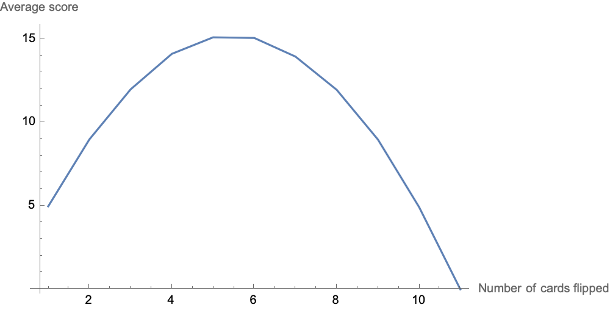

# Riddler solitaire: Optimal strategy for when to hang up the cards
This week’s riddler was too interesting to pass up:


>*Riddler solitaire is played with 11 cards: an ace, a two, a three, a four, a five, a six, a seven, an eight, a nine, a 10 and a joker. Each card is worth its face value in points, while the ace counts for 1 point. To play a game, you shuffle the cards so they are randomly ordered, and then turn them over one by one. You start with 0 points, and as you flip over each card your score increases by that card’s points — as long as the joker hasn’t shown up. The moment the joker appears, the game is over and your score is 0. The key is that you can stop any moment and walk away with a nonzero score.*

>*What strategy maximizes your expected number of points?”
As always, I like to solve these kinds of problems using simulation because it >shows just how powerful computational approaches can be.*

Let’s start first by creating the deck of cards and then we’ll run a bunch of “simulations” by taking a random order of the cards many times.
```
  cards = Join[Range[1, 10], {"J"}]
```
```
{1,2,3,4,5,6,7,8,9,10,"J"}
```
```
simulations = Table[RandomSample[cards], {20000}];
```
Next, let’s create a helper function to count of score for the given hand assuming we were to stop at anywhere from 1 - 11, noting however, that if we hit a “J” in one of our hands, we will then get a 0 score for that hand and number of cards combination.
```
scoreCounter[sim_] := 
 Table[hand -> 
   If[ContainsAny[sim[[1 ;; hand]], {"J"}], 0, 
    Total[sim[[1 ;; hand]]]], {hand, Length[cards]}]
```
Next, apply our helper function to the simulations and merge the results for the various number of cards dealt taking the average score.
```
scores = scoreCounter /@ simulations;
```
```
combinedScores = N@KeyValueMap[{##} &]@Merge[scores, Mean]
```
```
{{1.,4.97965},{2.,8.99795},{3.,11.9973},{4.,14.126},{5.,15.1157},{6.,15.0792},{7.,13.9603},{8.,11.9681},{9.,8.98645},{10.,4.93075},{11.,0.}}
```
We know this is an optimization function of some kind so we should be able to see some kind of global maximum in our results.
```
ListLinePlot[combinedScores, 
 AxesLabel -> {"Number of cards flipped", "Average score"}, 
 ImageSize -> 500]
```

And finally, let’s determine which hand is the optimal one to call it quits for which for this game is at 5 hands with an average likely score somewhere around 15.
```
combinedScores // MaximalBy[Last]
```
```
{{5.,15.1157}}
```